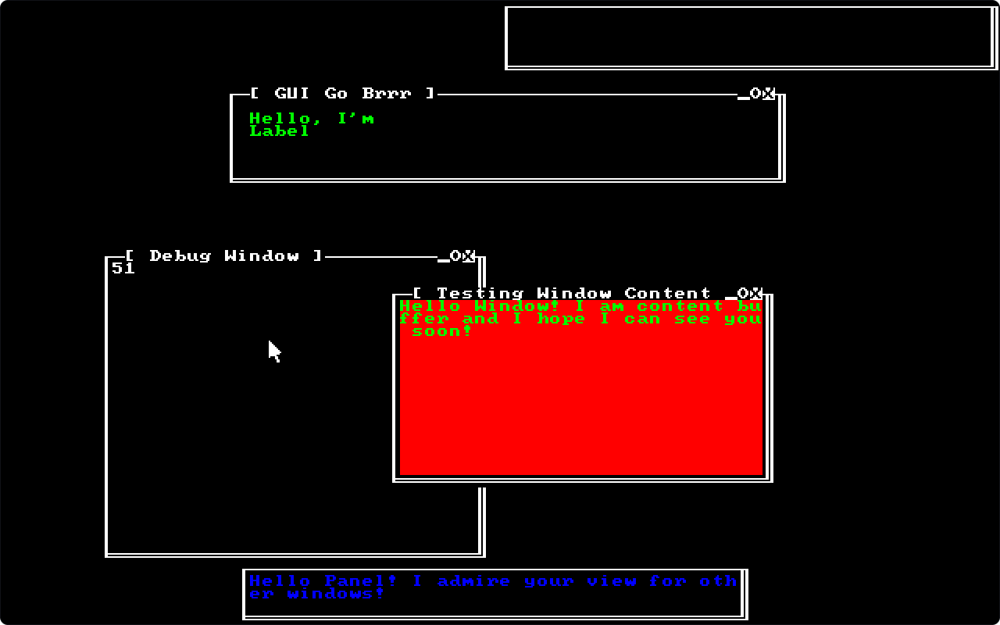

```
 ┌─────────────────┐
 │   Honzapkcz's   │
 │┌─[ Window ]─_OX╖│
 ││    Manager    ║│
 │╘═══════════════╝│
 ├─────────────────┤
 └─────────────────┘

? planned
~ working on
! untested
* finished

CORE:
 * TextBuffer
 * TextPanel
 ~ TextSystem (! split, - debug)
 * TextWidget
 * TextWM
 * TextWindow
PANEL:
 ~ TextLauncher
 ? TextSystemTray
 ? TextGridPanel
 ? TextWindowInfo
 ? TextGlobalMenu
 ? TextDigitalClock
 ? TextBinaryClock
CONTROL:
 ~ TextButton
 ? TextCheckBox
 ? TextMenuButton
 ! TextLabel (? alignment)
 ? TextLineEdit
 ? TextFileEdit
 ? TextHSlider
 ? TextVSlider
 ? TextProgressbar
 ? TextSpinBox
 ? TextImage
 ? TextRichLabel
 ? TextItemList
 ? TextTree
 ? TextMenu
CONTAINER:
 ? TextHBoxContainer
 ? TextVBoxContainer
 ? TextGridContainer
 ! TextPositionContainer (+ scroll)
 ? TextMarginContainer
 ? TextHSplitContainer
 ? TextVSplitContainer

 VGA Text Mode Buffer Layout 
 +---+-----------+------------+
 | B | Character |  Atribute  |
 +---+-----------+------------+
 | 7 | Char 7    | BG 3/Blink |
 | 6 | Char 6    | BG 2       |
 | 5 | Char 5    | BG 1       |
 | 4 | Char 4    | BG 0       |
 | 3 | Char 3    | FG 3/Font  |
 | 2 | Char 2    | FG 2       |
 | 1 | Char 1    | FG 1       |
 | 0 | Char 0    | FG 0/UndrL |
 +---+-----------+------------+

 VGA Color Pallete
 +-----+------------+
 | Hex | Color Name |
 +-----+------------+
 | 0x0 | Black      |
 | 0x1 | Blue       |
 | 0x2 | Green      |
 | 0x3 | Cyan       |
 | 0x4 | Red        |
 | 0x5 | Magenta    |
 | 0x6 | Brown      |
 | 0x7 | Gray       |
 | 0x8 | Dark Gray  |
 | 0x9 | BRGH Blue  |
 | 0xA | BRGH Green |
 | 0xB | BRGH Cyan  |
 | 0xC | BRGH Red   |
 | 0xD | BRGH Mgnta |
 | 0xE | Yellow     |
 | 0xF | White      |
 +-----+------------+

 VGA Color Pallete Encoding
 +--------+---------+
 | Bit    | 3 2 1 0 |
 +--------+---------+
 | Filter | W R G B |
 +--------+---------+

 DOS Code Page 437 Encoding
 +------+---------------------------------+
 |      | 0 1 2 3 4 5 6 7 8 9 A B C D E F |
 +------+---------------------------------+
 | 0x0. | ➀ ☺☻♥♦ ♣♠ • ◘○ ◙ ♂♀♪♫ ☼ |
 | 0x1. | ► ◄ ↕ ‼ ¶ §▬ ↨ ↑ ↓ → ← ∟↔ ▲ ▼ |
 | 0x2. |   ! " # $ % & ' ( ) * + , - . / |
 | 0x3. | 0 1 2 3 4 5 6 7 8 9 : ; < = > ? |
 | 0x4. | @ A B C D E F G H I J K L M N O |
 | 0x5. | P Q R S T U V W X Y Z [ \ ] ^ _ |
 | 0x6. | ` a b c d e f g h i j k l m n o |
 | 0x7. | p q r s t u v w x y z { | } ~ ⌂ |
 | 0x8. | Ç ü é â ä à å ç ê ë è ï î ì Ä Å |
 | 0x9. | É æ Æ ô ö ò û ù ÿ Ö Ü ¢ £ ¥ ₧ ƒ |
 | 0xA. | á í ó ú ñ Ñ ª º ¿ ⌐ ¬ ½ ¼ ¡ « » |
 | 0xB. | ░ ▒ ▓ │ ┤ ╡ ╢ ╖ ╕ ╣ ║ ╗ ╝ ╜ ╛ ┐ |
 | 0xC. | └ ┴ ┬ ├ ─ ┼ ╞ ╟ ╚ ╔ ╩ ╦ ╠ ═ ╬ ╧ |
 | 0xD. | ╨ ╤ ╥ ╙ ╘ ╒ ╓ ╫ ╪ ┘ ┌ █ ▄ ▌ ▐ ▀ |
 | 0xE. | α ß Γ π Σ σ µ τ Φ Θ Ω δ ∞ φ ε ∩ |
 | 0xF. | ≡ ± ≥ ≤ ⌠ ⌡ ÷ ≈ ° ∙ · √ ⁿ ² ■ ➁ |
 +------+---------------------------------+
 |  ➀  | Null Character                   |
 |  ➁  | Non-Breakable Space Character    |
 +------+---------------------------------+
```
